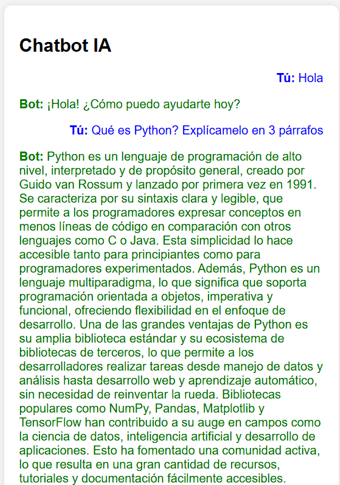
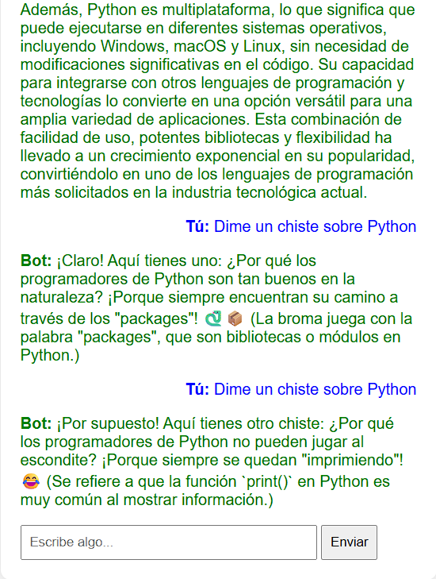

# Chatbot IA con Django

Aplicación web desarrollada con Django que integra un modelo de Inteligencia Artificial mediante API para generar respuestas dinámicas en tiempo real.
El sistema permite interacción tipo chat y mantiene el contexto de la conversación utilizando sesiones.

---

## Descripción

Este proyecto implementa un chatbot web donde el usuario envía mensajes a través de una interfaz simple y recibe respuestas generadas por un modelo de lenguaje.

El flujo del sistema es:

Usuario → envío de mensaje → API de IA → respuesta → render en interfaz

Se incluye manejo de estado mediante sesiones para conservar el historial de conversación y proporcionar respuestas con contexto.

---

## Funcionalidades

* Interfaz web tipo chat
* Envío y recepción de mensajes en tiempo real
* Integración con API de Inteligencia Artificial
* Manejo de sesiones para conservar historial
* Conversación contextual (memoria de mensajes)

---

## Tecnologías utilizadas

* Python 3
* Django
* OpenAI API
* HTML
* CSS

---

## Seguridad

La API key no está incluida en el código.
Se maneja mediante variables de entorno utilizando un archivo `.env`, el cual está excluido del repositorio mediante `.gitignore`.

---

## Aprendizajes

Este proyecto permitió:

* Integrar un modelo de IA dentro de una aplicación web real
* Implementar comunicación entre frontend, backend y API externa
* Manejar estado con sesiones en Django
* Construir una interfaz funcional para interacción con IA
* Comprender el flujo completo de una aplicación con IA aplicada

---

## Posibles mejoras

* Persistencia en base de datos en lugar de sesiones
* Autenticación de usuarios
* Mejora de interfaz (UI/UX)
* Despliegue en la nube
* Streaming de respuestas en tiempo real

---

## Autor

Aiko Marín
